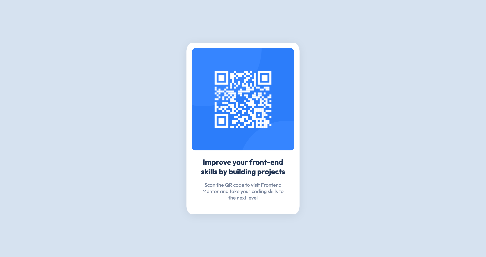

# Frontend Mentor - QR code component solution

This is a solution to the [QR code component challenge on Frontend Mentor](https://www.frontendmentor.io/challenges/qr-code-component-iux_sIO_H). Frontend Mentor challenges help you improve your coding skills by building realistic projects. 

## Table of contents

- [Overview](#overview)
  - [Screenshot](#screenshot)
  - [Links](#links)
- [My process](#my-process)
  - [Built with](#built-with)
  - [What I learned](#what-i-learned)
  - [Useful resources](#useful-resources)
- [Author](#author)

## Overview

### Screenshot

### Links

- Solution URL: [Add solution URL here](https://your-solution-url.com)
- Live Site URL: [Add live site URL here](https://your-live-site-url.com)

## My process

### Built with

- Semantic HTML5 markup
- CSS custom properties
- Flexbox

### What I learned

I knew how to specify a color with color name, HEX value, RGB/RGBA value, but I learned about HSL which stands
for hue, saturation, and lightness. I also learned about `box-shadow` and I like the effect it gives to the card.

### Useful resources

- [CSS Tricks](https://css-tricks.com/almanac/properties/b/box-shadow/) - Good examples to understand how
  `box-shadow` works. 

## Author

- Website - [More Coffee](https://more-coffee.net)
- Frontend Mentor - [@myrdn](https://www.frontendmentor.io/profile/myrdn)
